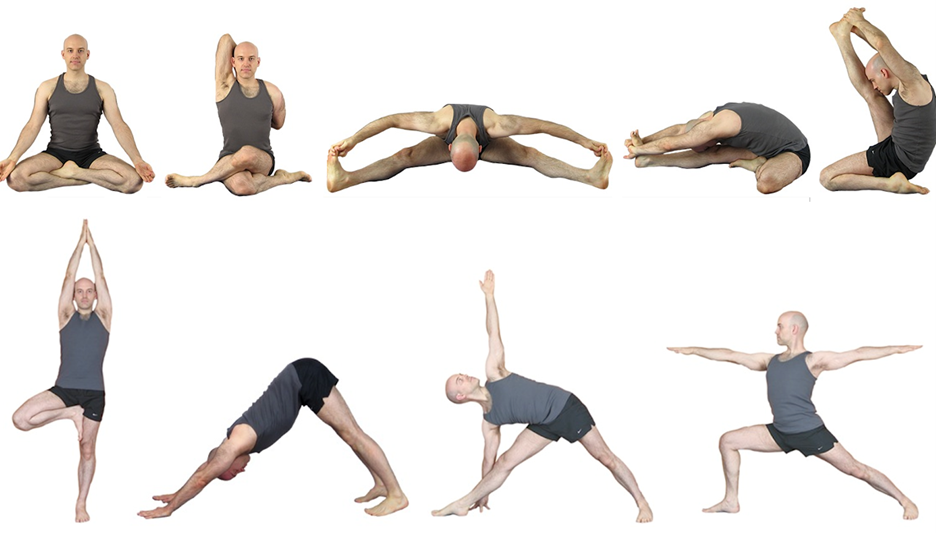
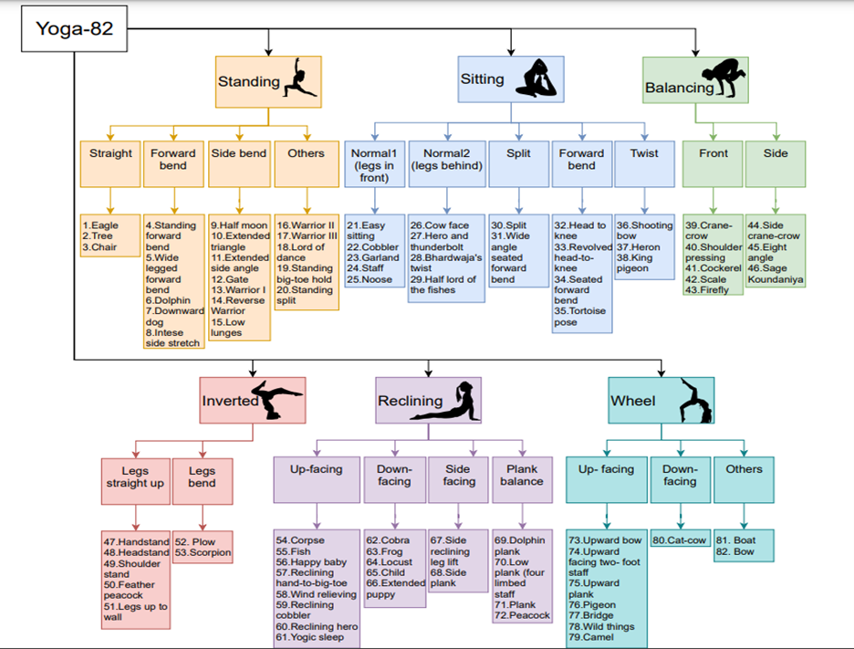

# Yogaposes AII22 Challenge

This repository contains the data related to the AII 2022 Challenge. 

[[_TOC_]]

## About the conference
This 2nd International Conference on Applied Intelligence and Informatics – [AII2022](https://www.aii2022.org) provides a premier international forum to bring together researchers and practitioners from diverse domains for the sharing of cutting-edge research results obtained through the application of intelligence and/or informatics to solve problems otherwise would not have been possible to solve. AII2022 also fosters exchange and dissemination of innovative and practical development of methodologies and technologies with real-life applications. AII2022 asks all authors to make their dataset and methodology open access for the community usage. This is to: **Foster the Reproducibility of Scientific Results**, hence is the theme of the conference. The conference will be held in Reggio Calabria, a beautiful seaside city located in the southernmost tip of Italy.

## About the problem
Human pose estimation is one of the challenging computer vision problems which has potential applications in various fields such as visual surveillance, behavioral analysis, assisted living and intelligent driver assistance system [1]. 

Various Human Poses (Yoga postures)

## About the dataset
To handle more variety in human poses, we are using a fine-grained hierarchical pose classification dataset named Yoga-82 for this competition proposed by [1]. This dataset formulates the pose estimation as a classification task. The Yoga-82 database has samples belonging to 82 different classes (yoga poses). The dataset provides hierarchical labels for yoga poses based on the body configuration of the pose. The dataset contains a three-level hierarchy including body positions, variations in body positions, and the actual pose names. 

Yoga-82 dataset label structure. Hierarchical class names at level 1, 2, and 3 (Pic taken from [1]) 

The output category labels are a three-level hierarchical structure where the third level is a leaf node corresponding to any yoga poses class. There are 6, 20, and 82 classes in the first-, second-, and third levels, respectively as illustrated in the above figure. The top level of classification corresponds to standing, Sitting, Balancing, Inverted, Reclining, and Wheel positions. Similarly the second and third level of classification can be inferred from the above figure.  

## Challenge
The top three winners of the competition will have the below benefits: 
1) Free registration to the conference. 
2) 14 days extra to submit their paper.
3) A certificate with the indication of the position in the ranking list (1st, 2nd, 3rd)

The deadline for the submission of solution: **1st May, 2022**. 

Further information and updates at [AII2022](https://www.aii2022.org). The competition is hosted on [Kaggle](https://www.kaggle.com/c/ai2022-competition).

## Reference
[1]	Verma, Manisha, Sudhakar Kumawat, Yuta Nakashima, and Shanmuganathan Raman. "Yoga-82: a new dataset for fine-grained classification of human poses." In Proceedings of the IEEE/CVF Conference on Computer Vision and Pattern Recognition Workshops, pp. 1038-1039. 2020.

## Challenge organizers
- Gennaro Coradasco(Universita' degli Studi della Campania "Luigi Vanvitelli", Italy) 
- Stefano Marrone (Università della Campania "Luigi Vanvitelli", Italy ) and 
- Noushath Shaffi (University of Technology and Applied Sciences, Sultanate of Oman)